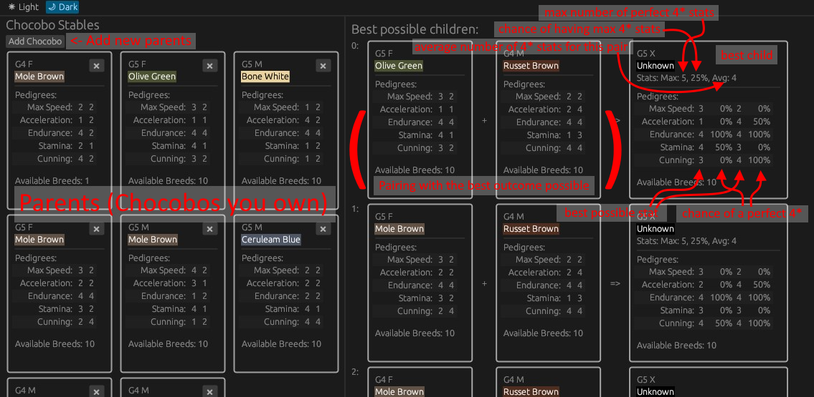

# Race Chocobo Optimizer

## How to use:

The web app version of this project is available [here](https://speedy321.github.io/race_chocobo_optimizer/) (hosted on github pages).

In the left panel, use the "add chocobo" button to open the new chocobo panel. Add every chocobo you want to optimize the pairings of. Usually that should be every one of your retired chocobo, covering permissions and fledgling registrations. 

While adding chocobos, the center panel should start showing possible children taken from the pool of parents. This list displays the best possible pairings and the resulting children. As shown in the above screenshot. Each "best possible child" displays the chance of getting a perfect 4* for every one of it's pedigree stats, both from it's mother and father, as well as the maximum amount of 4* stats it can get, the chance of these parents giving out that maximum amount in any given children from the pair and the average amount of stars that can be expected.

Your are then free to choose which pair you want to have reproduce together. Once you get new child chocobos, you can then add them to the pool or parents and see new optimal pairs possibly appear.

##### Known weaknesses:
As of now, this does not simulate the gender of the child, nor the color or the race ability inheritance. This is because these are all 50% chance from either parent and not really important for the purpose of inbreeding. You may want to start by breeding a stable of chocobos of the same color you want if that is important to you. The race ability you want to inherit can be introduced at basically the last generation by simply teaching it to both future parents before retiring them.

## Contributing:
This project is opensource. While I will not give any garantie of continued support, bug fixing or otherwise, I aim to at least keep an eye out for issues and improvements in the future. So feel free to either open an issue on this github repo, contact me directly, or fork the project and create a pull request to add features or fixes. You will find the framework's readme file [here](FrameworkDoc.md) which contains a good explanation of how to setup the project to work on it.

